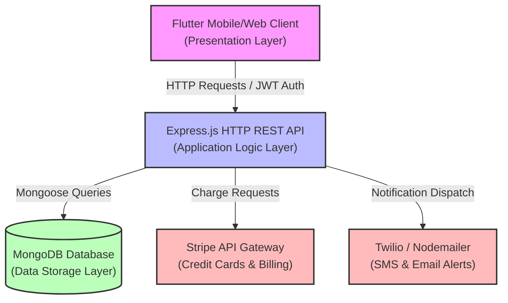
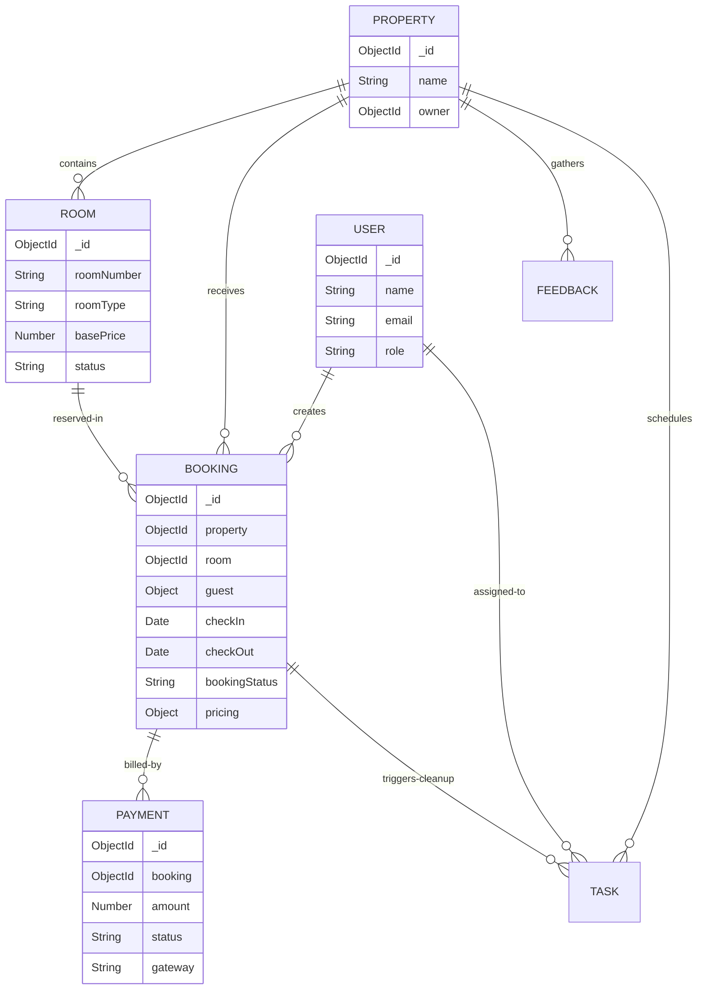
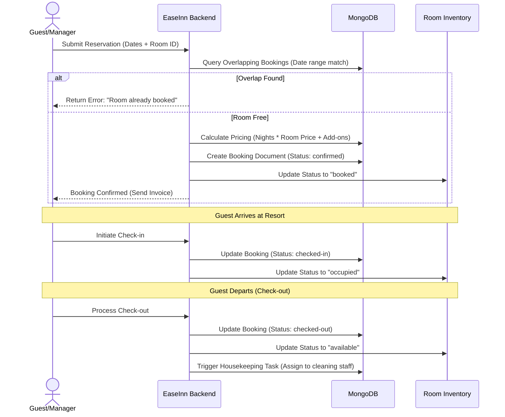

# EaseInn: Property Management System (PMS)
## A BMIT-Oriented Explanation & Presentation Guide

This guide is structured to help you explain the **EaseInn Resort Property Management System (PMS)** to a **Business & Management Information Technology (BMIT)** student. It translates the project's technical architecture into the academic and practical frameworks studied in BMIT (e.g., Systems Analysis & Design, Database Management, Business Process Modeling, Decision Support Systems, and IT Governance).

---

## 1. Executive Summary & The Business Problem
In BMIT, every system exists to solve a business problem and create value.
* **The Business Problem**: Independent resorts and hotels struggle with operational inefficiencies, double-bookings, manual staff delegation, fragmented feedback channels, and opaque revenue metrics.
* **The System Solution (EaseInn)**: A full-stack, multi-tenant property management system that automates the core operational loop: **Guest Bookings & Billing** $\rightarrow$ **Room Availability Status** $\rightarrow$ **Housekeeping Task Distribution** $\rightarrow$ **Revenue Analytics & Reporting**.
* **Value Proposition**: 
  * **Operational Efficiency**: Eliminates communication lags between the reception (bookings) and housekeeping (room preparation).
  * **Financial Security**: Guarantees payments through integrated card gateways and records audit logs of transactions.
  * **Strategic Intelligence**: Uses descriptive revenue dashboards and predictive forecasting to help owners optimize room pricing.

---

## 2. Technology Stack & IT Framework
BMIT courses emphasize aligning the right technology infrastructure with organizational needs.



* **Frontend (Presentation Layer - Flutter/Dart)**:
  * A single, cross-platform codebase compiling to mobile (Android/iOS) and web/desktop apps.
  * **BMIT Angle**: Reduces the Total Cost of Ownership (TCO) and time-to-market compared to developing separate native apps.
* **Backend (Application/Business Logic Layer - Express.js/Node.js)**:
  * Stateless, lightweight API server implementing the **Controller-Service-Repository** pattern.
  * **BMIT Angle**: Ensures separation of concerns. If the user interface changes, the underlying business rules (booking logic, security) remain untouched.
* **Database (Data Layer - MongoDB/Mongoose)**:
  * Document-oriented, schema-flexible NoSQL database.
  * **BMIT Angle**: Resorts often add custom attributes (e.g., room view, mini-bar options, accessibility parameters) dynamically. A NoSQL database represents these complex, nested objects natively in JSON without the rigid constraints and complex joins of SQL.

---

## 3. Database Design & Entity-Relationship Diagram (DBMS)
Data Modeling is a cornerstone of BMIT. EaseInn maps resort operations into nine primary logical collections.

### Mongoose Collection Schema Mappings
1. **User**: Represents employees (Owners, Managers, Staff) and guests. Stores credentials (hashed) and roles.
2. **Property**: Holds the resort metadata (name, address, owner ref, facilities).
3. **Room**: Represents the physical inventory. Attributes: `roomNumber`, `roomType`, `basePrice`, `status` (`available`, `booked`, `maintenance`, `cleaning`).
4. **Booking**: Tracks reservations. Attributes: guest details, check-in/out dates, price calculations, and check-in statuses (`pending`, `confirmed`, `checked-in`, `checked-out`, `cancelled`).
5. **Payment**: Financial logs connected to bookings. Tracks amount, transaction reference, gateway status, and billing type.
6. **Task**: Operations and housekeeping tickets. Assigned to staff with subtask check-lists.
7. **Feedback**: Guest surveys and reviews, enabling Managers to reply (CRM).
8. **Notification**: In-app push/system messages.
9. **AuditLog**: Security log recording *who* did *what*, *when*, and from *which IP address*.

### Entity Relationship Model (ERD)
The logical connections between the documents:



---

## 4. Core Business Processes & Workflows
A BMIT student must understand how systems automate real-world workflows.

### A. Role-Based Access Control (RBAC) & Authorization
EaseInn enforces clear segregation of organizational duties (IT Governance):
* **Owner (Admin)**: Full system control. Manages property configurations, updates user roles, overrides pricing, and reviews consolidated multi-property financial records.
* **Manager**: Oversees day-to-day operations. Adds/updates rooms, manages bookings, generates tasks, and processes check-ins/out.
* **Staff (Housekeeping/Maintenance)**: Operates through a task-based dashboard. Views assigned cleanups, updates checklist subtasks, and marks jobs as complete.
* **Guest (User)**: Makes bookings online, views booking history, makes payments, and submits feedback reviews.

### B. The Booking & Inventory Lifecycle
This flow maps the transactional integrity of checking a guest in and out while avoiding booking overlaps.



---

## 5. E-Commerce & External Integrations
Modern IT systems do not live in isolation; they integrate with external API providers.
* **Financial Layer (Stripe)**:
  * Handles PCI-compliant online card payments.
  * When a booking is processed, EaseInn communicates with Stripe to authorize charges. Stripe passes back a secure token, transaction ID, and status (`succeeded`, `failed`), updating the `Payment` document.
* **Communication Layer (Twilio & Nodemailer)**:
  * Automatically sends confirmation messages and billing reminders.
  * **BMIT Concept**: Customer Relationship Management (CRM) automation. Redundant notifications reduce customer anxiety and lower the administrative overhead of manual call centers.

---

## 6. Business Intelligence & Decision Support Systems (DSS)
This is the most critical segment for BMIT. Systems are not just data collectors; they must act as **Decision Support Systems (DSS)** to help managers make strategic choices.

### A. Descriptive Analytics (What Happened?)
The dashboard aggregates operational metrics to showcase the resort’s health:
* **Occupancy Report**: Computes $Occupancy\ Rate = \frac{Rooms\ Occupied}{Total\ Rooms} \times 100$. Helps managers assess seasonal space utilization.
* **Revenue Aggregations**: Uses MongoDB’s aggregation pipeline to sum up all completed payment objects, grouped by month, property, or room type.
* **Task Performance Analytics**: Evaluates how long staff members take to complete cleaning and maintenance tasks, highlighting operational bottlenecks.

### B. Predictive Analytics (What Will / Should Happen?)
EaseInn incorporates basic forecasting models to guide managers:
1. **Dynamic "AI" Pricing Suggestions (`advanced.controller.js`)**:
   * Evaluates historical room occupancies and standard calendar behaviors.
   * Recommends dynamically altered rates using:
     * **Weekday Multiplier**: Base Price ($1.0\times$).
     * **Weekend Multiplier**: ($1.2\times$) based on higher weekend leisure travel.
     * **Peak Season Multiplier**: ($1.5\times$) based on holidays or high-demand periods.
     * **Low Season Multiplier**: ($0.85\times$) discount to attract bookings during slow weeks.
   * **Confidence Rating**: Tells the manager how reliable the recommendation is based on the volume of historical bookings.
2. **Demand Forecasting (`advanced.controller.js`)**:
   * Analyzes booking rates over a rolling 90-day period.
   * Predicts future volumes using a moving average and a monthly growth index.
   * Helps owners manage staffing, supply chains, and food inventory adjustments.

---

## 7. Security, Auditing & IT Governance
BMIT students study risk management, audit requirements, and security baselines.

* **Audit Logs (`auditLog.model.js`)**:
  * Every critical action (updating room pricing, deleting bookings, registering new users) is recorded.
  * **Audit Log Schema**:
    ```javascript
    {
      user: ObjectId,        // Who did it
      action: String,        // 'create', 'update', 'delete', etc.
      entity: String,        // 'Booking', 'Room', 'Payment'
      entityId: ObjectId,    // Target record
      description: String,   // Explanation ("Checked-in John Doe")
      ip: String,            // Request IP address (for forensic trackability)
      createdAt: Date        // Timestamp
    }
    ```
  * **BMIT Significance**: Critical for compliance, detecting internal fraud, and reconstructing system state during disputes.
* **API Security Baselines**:
  * **Helmet Middleware**: Configures HTTP headers to protect against Cross-Site Scripting (XSS) and clickjacking.
  * **Express Rate Limiting**: Mitigates Denial of Service (DoS) attacks by limiting API calls per client IP.
  * **Bcryptjs Hashing**: Ensures password security by hashing credentials before saving them in MongoDB.
  * **Stateless JWTs (JSON Web Tokens)**: Secure token exchanges to maintain session states without overloading server memory.

---

## 8. Summary of Presentation Talking Points
When explaining this to a BMIT student, frame your discussion around these five core themes:

| Theme | How EaseInn Represents It | Academic BMIT Concept |
| :--- | :--- | :--- |
| **System Architecture** | Flutter Frontend, Node.js REST API, MongoDB database. | **3-Tier Client-Server Architecture** & Separation of Concerns. |
| **Data Modeling** | Collections mapped with Mongoose, document cross-references (`populate`). | **NoSQL vs. Relational Databases**, Data Normalization, Schema Design. |
| **Operational Automation** | Check-in workflow updates room states and fires housekeeping schedules automatically. | **Business Process Re-engineering (BPR)** & Workflow Automation. |
| **Decision Support (DSS)** | AI Pricing Suggestions (weekday/end multipliers) & demand forecast models. | **Business Intelligence (BI)**, Descriptive & Predictive Analytics. |
| **Risk & Compliance** | System-wide Audit Logs, Bcrypt, Helmet headers, Role-Based Route guards. | **IT Governance**, Audit Trails, Information Security (InfoSec) Controls. |

---
*Created as a BMIT explanatory guide for the EaseInn Resort Property Management System.*
